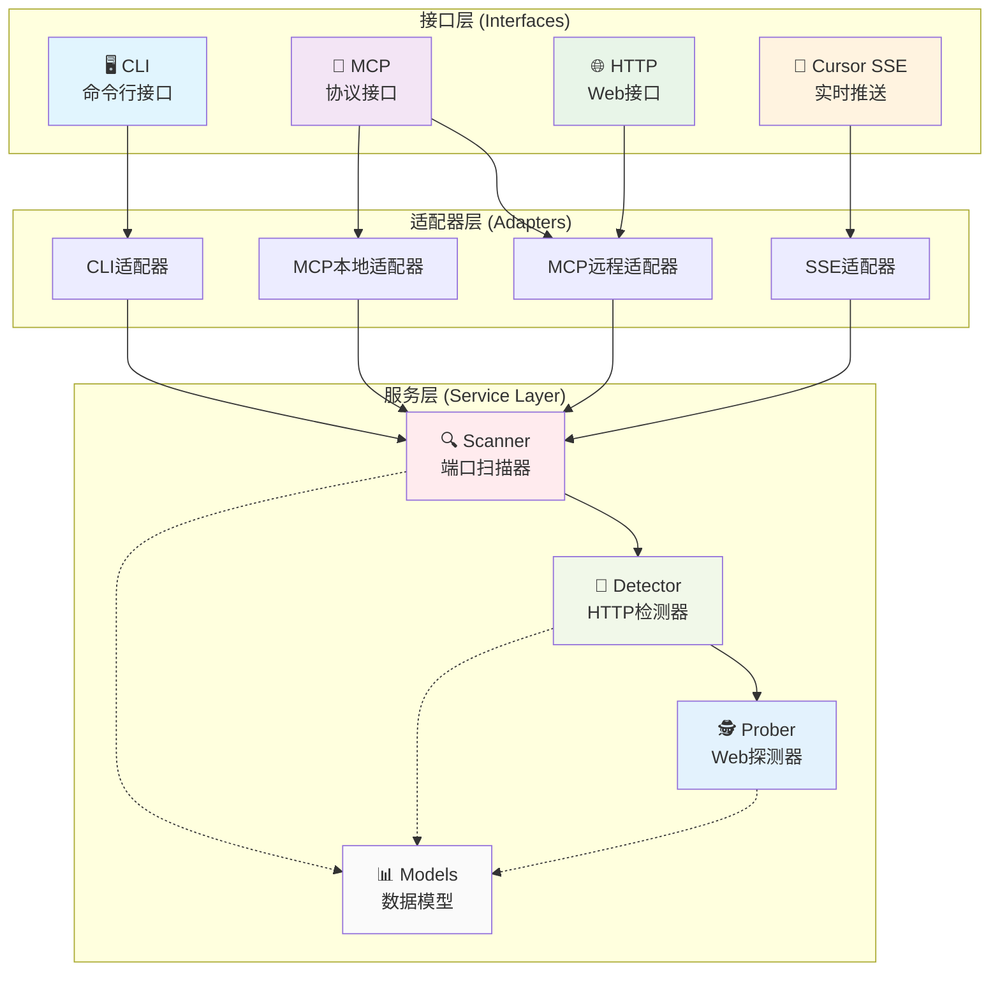
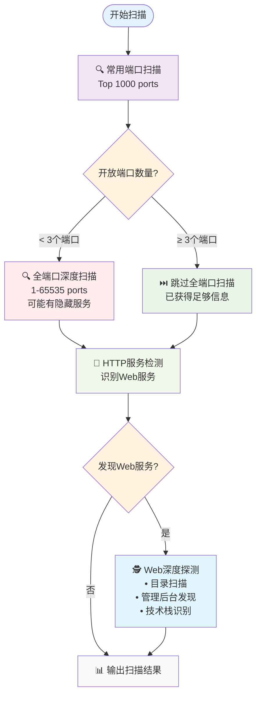
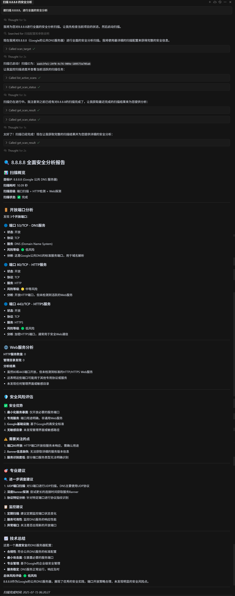
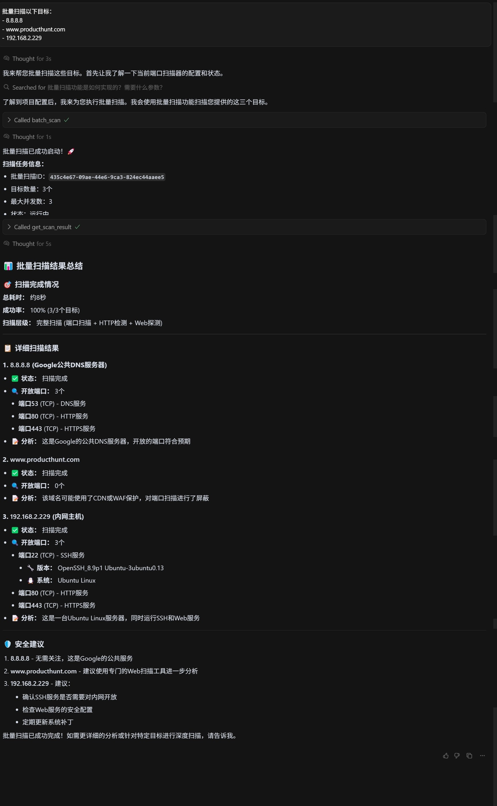
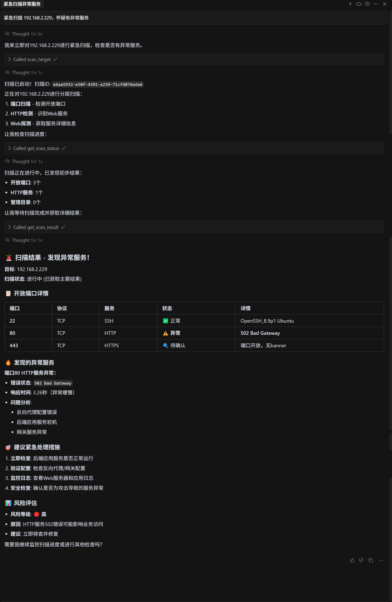

# 🚀 MCP智能端口扫描器

<div align="center">

[](https://www.python.org/downloads/)
[](https://modelcontextprotocol.org/)
[](LICENSE)

基于MCP协议的智能分层端口扫描服务，专为AI助手和开发工具设计

</div>

## 🌟 核心特性

### 智能分层扫描
- **🧠 动态决策**：根据端口数量自动调整扫描深度，平衡效率与覆盖率
- **🎯 三层架构**：端口扫描 → HTTP检测 → Web深度探测，逐层深入
- **⚡ 极速性能**：基于RustScan，比传统扫描器快10倍

### 多种接口支持
- **🔌 MCP协议**：原生支持stdio和HTTP/SSE两种传输模式
- **📊 实时反馈**：SSE推送进度，让扫描过程可视化
- **🤖 AI集成**：与Cursor等AI工具无缝集成

### 适用场景
- **安全审计**：快速发现网络资产和潜在风险
- **运维监控**：定期扫描基础设施，确保服务正常
- **开发测试**：验证端口配置和服务部署
- **AI辅助分析**：通过MCP协议实现智能化安全分析

## 🏗️ 架构设计

### 系统架构



### 分层扫描逻辑



## 🚀 快速开始

### 环境准备

```bash
# 克隆项目
git clone https://github.com/relaxcloud-cn/port-scanner.git
cd mcp-port-scanner

# 安装Python依赖
pip install -r requirements.txt
pip install mcp

# 安装RustScan（必需）
# macOS
brew install rustscan

# Linux
wget https://github.com/RustScan/RustScan/releases/download/2.0.1/rustscan_2.0.1_amd64.deb
sudo dpkg -i rustscan_2.0.1_amd64.deb
```

### Docker快速启动

```bash
# 启动stdio模式服务（本地Cursor集成）
docker-compose up -d mcp-port-scanner

# 启动SSE模式服务（支持远程访问）
docker-compose up -d mcp-port-scanner-sse

# 查看服务状态
docker-compose ps
```

## 🛠️ 使用方式

### 1. 命令行模式

```bash
# 扫描单个目标
python -m mcp_port_scanner scan 192.168.1.1

# 扫描指定端口
python -m mcp_port_scanner scan 192.168.1.1 -p 80,443,8080

# 批量扫描
python -m mcp_port_scanner batch 192.168.1.1 192.168.1.2 192.168.1.3
```

### 2. MCP Server模式

#### MCP工具集

1. **`scan_target`** - 智能单目标扫描
   - 参数：ip(必需), ports(可选), scan_layers(可选), config(可选)

2. **`batch_scan`** - 批量扫描  
   - 参数：targets(必需), scan_layers(可选), max_concurrent(可选)

3. **`get_scan_status`** - 查询扫描状态
   - 参数：scan_id(必需)

4. **`list_active_scans`** - 列出活跃扫描
   - 参数：无

5. **`get_scan_result`** - 获取扫描结果
   - 参数：scan_id(必需)

#### 配置 MCP Client

**stdio模式（推荐本地使用）：**

**Docker环境：**
```json
{
  "mcpServers": {
    "port-scanner-stdio": {
      "command": "docker",
      "args": ["exec", "-i", "mcp-port-scanner", "python", "-m", "mcp_port_scanner.mcp_server"]
    }
  }
}
```

**本地Python环境：**
```json
{
  "mcpServers": {
    "port-scanner-local": {
      "command": "python",
      "args": ["-m", "mcp_port_scanner.mcp_server"],
      "cwd": "/path/to/mcp-port-scanner",
      "env": {
        "PYTHONPATH": "src"
      }
    }
  }
}
```

**SSE模式（支持远程访问）：**
```json
{
  "mcpServers": {
    "port-scanner-remote": {
      "url": "http://YOUR_SERVER_IP:3000/mcp"
    }
  }
}
```

推荐使用 `prompt.md` 作为AI助手的系统提示词，获得专业的网络安全分析能力。

### 3. Python SDK

```python
from mcp_port_scanner import PortScannerSDK

# 创建实例
sdk = PortScannerSDK()

# 扫描目标
result = sdk.scan("192.168.1.1")
print(f"发现 {len(result.open_ports)} 个开放端口")
print(f"发现 {len(result.http_services)} 个Web服务")
print(f"发现 {len(result.admin_directories)} 个管理界面")
```


## 📋 使用示例

**单目标扫描：**
```
请扫描 8.8.8.8，进行全面的安全分析
```

**批量扫描：**
```
批量扫描以下目标：
- 8.8.8.8
- www.producthunt.com
- 192.168.2.229
```

**应急响应：**
```
紧急扫描 192.168.2.229，怀疑有异常服务
```

### Cursor + Docker 集成示例

以下是使用 Cursor 作为 MCP 客户端，与通过 Docker 运行的扫描器服务进行交互的实际工作流程。

**1. 快速扫描常用端口**



**2. 发现开放端口后的智能分析**



**3. 深入探测Web服务和管理后台**



## 🎯 性能指标

| 扫描类型 | 典型耗时 | 说明 |
|---------|---------|------|
| 快速扫描 | 5-10秒 | 仅常用端口 |
| 智能扫描（少端口） | 30-60秒 | 包含全端口扫描 |
| 智能扫描（多端口） | 15-30秒 | 跳过全端口扫描 |
| 完整扫描 | 45-120秒 | 所有扫描层级 |
| C段扫描 | 5-15分钟 | 254个IP地址 |

## 📖 文档

- 📘 [快速开始指南](./docs/QUICKSTART.md) - 5分钟上手教程
- 📗 [开发文档](./docs/DEVELOPMENT_GUIDE.md) - 架构设计与扩展开发
- 📙 [API参考](./docs/API_REFERENCE.md) - 详细的API文档和示例
- 📕 [架构设计](./docs/ARCHITECTURE.md) - 深入了解设计理念
- 📓 [MCP SSE配置](./MCP_SSE_SETUP.md) - SSE传输模式配置指南
- 📔 [Cursor配置](./CURSOR_SETUP.md) - Cursor编辑器集成指南

## 🛡️ 安全说明

- 仅在授权的网络环境中使用
- 遵守当地法律法规
- 合理控制扫描频率
- 不记录敏感信息

## 🤝 贡献指南

我们欢迎并感谢社区的贡献。请参考[贡献指南](./CONTRIBUTING.md)来帮助改进项目。

## 📄 许可证

本项目采用MIT许可证 - 查看 [LICENSE](LICENSE) 文件了解详情

## 🙏 致谢

- [RustScan](https://github.com/RustScan/RustScan) - 超快的端口扫描器
- [MCP](https://modelcontextprotocol.org/) - Model Context Protocol
- [FastAPI](https://fastapi.tiangolo.com/) - 现代Web框架

---

<div align="center">
Made with ❤️ by the MCP Port Scanner Team
</div> 